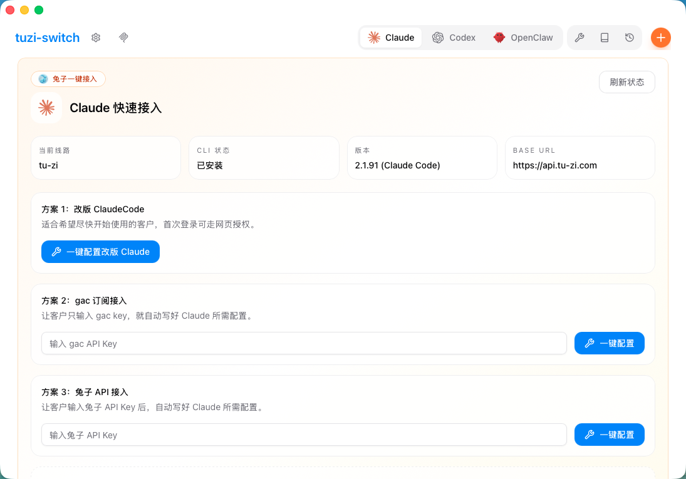
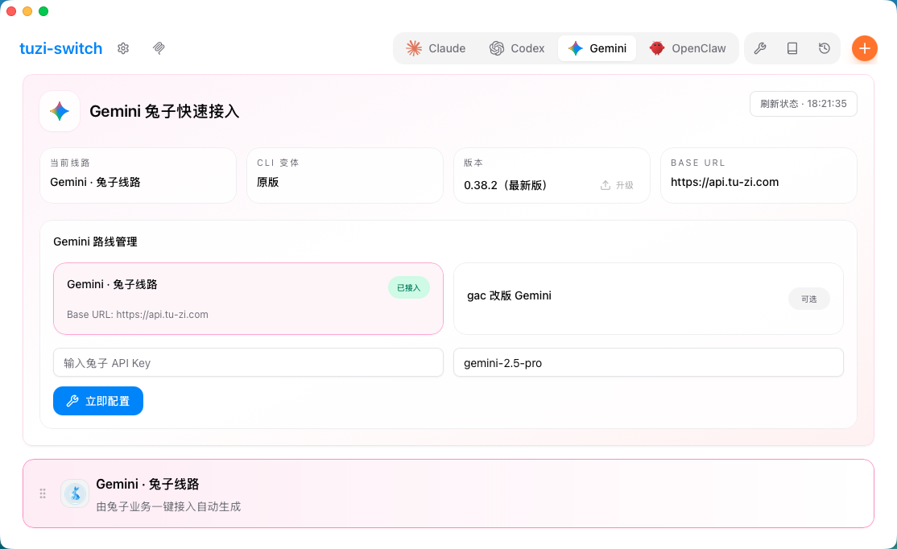
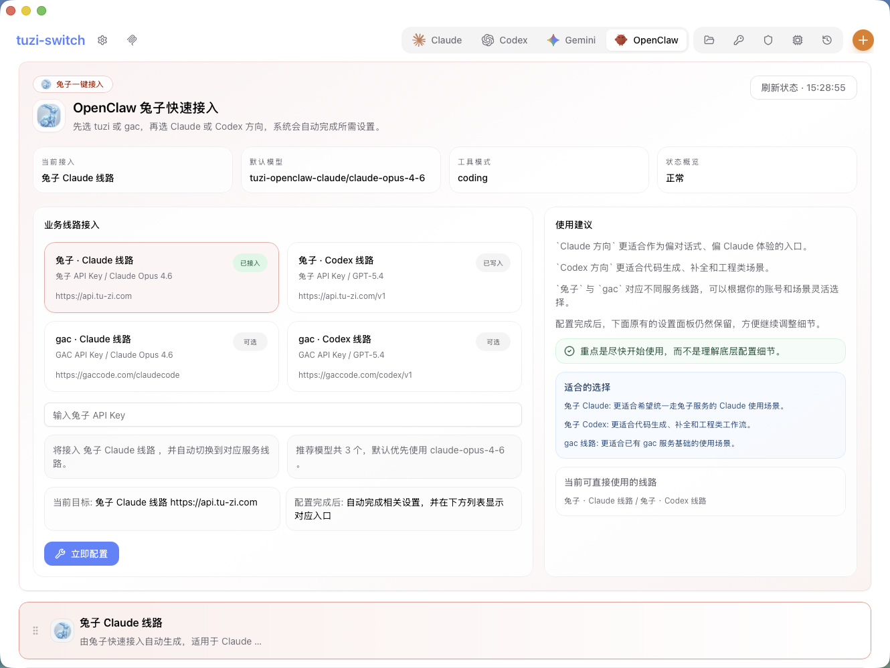

<div align="center">

# tuzi-switch

### Claude Code、Codex、Gemini、OpenClaw 向けの Tuzi 業務デスクトップアシスタント

[](https://github.com/tuziapi/tuzi-switch/releases)
[](https://github.com/tuziapi/tuzi-switch/releases)
[](https://github.com/tuziapi/tuzi-switch/releases)
[](https://tauri.app/)

[中文](README.md) | [English](README_EN.md) | 日本語 | [Releases](https://github.com/tuziapi/tuzi-switch/releases)

</div>

## ダウンロード

最新のインストーラは [GitHub Releases](https://github.com/tuziapi/tuzi-switch/releases) から取得できます。

推奨パッケージ:

- Windows: `.msi`
- Windows ポータブル版: 現在の Release に含まれる場合は `Windows-Portable.zip`
- Linux: `.AppImage`、`.deb`、`.rpm`
- macOS: `macOS-unsigned.dmg` または `macOS-unsigned.zip`

現在の公開 Release は Windows / Linux での利用を前提にしています。macOS は未署名のテストビルドです。

### ワンコマンドインストール

現在の推奨版 `v3.12.11` を直接インストール:

```bash
curl -fsSL https://raw.githubusercontent.com/tuziapi/tuzi-switch/main/scripts/install_tuzi_switch.sh | env TUZI_SWITCH_TAG=v3.12.11 bash
```

補足:

- 現在の Release workflow は引き続き `prerelease` 方式で公開されています
- そのため GitHub の `releases/latest` では、最新のテスト版を正しく取れない場合があります
- README のコマンドは `v3.12.11` に固定し、現在の推奨版を確実に入れられるようにしています
- 別バージョンを入れたい場合は `TUZI_SWITCH_TAG=vX.Y.Z` の値を差し替えてください

### macOS 未署名ビルド

初回起動時に macOS にブロックされた場合は、次のいずれかを実行してください。

1. アプリを右クリックして `開く` を選び、確認ダイアログでもう一度 `開く` を押す
2. またはターミナルで以下を実行する

```bash
xattr -dr com.apple.quarantine "/Applications/tuzi-switch.app"
open "/Applications/tuzi-switch.app"
```

`/Applications` 以外に配置した場合は、パスを実際の場所に置き換えてください。

## tuzi-switch とは

tuzi-switch は CC Switch をベースにした Tuzi 業務向けのカスタム版です。多ツール管理の基盤は残しつつ、Tuzi のお客様がより簡単に接続できる導線を優先しています。

現在の中心入口は次の 4 つです。

- Claude Code
- Codex
- Gemini
- OpenClaw

ユーザーは Tuzi Key を 1 回入力するだけで、ルート設定とローカル設定をより素早く完了できます。設定ファイルを手動編集する前提ではありません。

## 現在のバージョン更新内容

現在の公開版は `v3.12.11` で、今回の主な更新は以下です。

- Claude、Codex、Gemini、OpenClaw の各入口で、ルート管理体験の磨き込みを継続
- ライト / ダーク両テーマで、モジュール色、選択状態、下部カード高亮、状態ヒントの表現をさらに統一
- OpenClaw の導線階層と提案ブロックを見直し、業務ルートの選択がわかりやすくなった
- Gemini や Codex 周辺の状態取得と現在ルート判定ロジックをさらに補正
- 上部のクイック接入エリアと下部のプロバイダ一覧の視覚一貫性を改善

## 製品のポイント

- Claude Code、Codex、Gemini、OpenClaw 向けの Tuzi 優先クイック入口
- メイン画面から Tuzi / GAC ラインの案内付きで接続設定を実行
- Tuzi ブランドのビジュアル、アイコン、接入カード
- アプリ内でのプロバイダ切り替えとデスクトップ版ベースのトレイ切り替え導線
- Providers、MCP、Prompts、Skills など既存基盤機能を継続利用
- Tauri 2 ベースのデスクトップアプリ構成

## 現在のカスタマイズ方針

上流版と比べると、この版は汎用的な高機能ツールというより、業務導入と顧客オンボーディングを重視しています。

- 右上の入口エリアを Tuzi 接続フロー向けに再構成
- Claude Code、Codex、Gemini、OpenClaw に個別のインストール / 設定入口を用意
- Tuzi クイック設定を主要導線として前面に配置
- 一部の汎用設定や構成フローを簡素化

## 画面プレビュー

### Claude



### Codex


### Gemini



### OpenClaw



## クイックスタート

1. [Releases](https://github.com/tuziapi/tuzi-switch/releases) から最新版をダウンロード
2. `tuzi-switch` を起動
3. Claude Code、Codex、Gemini、OpenClaw のいずれかを選択
4. ガイドに従って Tuzi Key を入力
5. ワンクリック設定を完了して利用開始

## 主な機能

### ツール入口

- Claude Code、Codex、Gemini、OpenClaw の独立した入口
- 対応ツール向けのインストール / 更新ガイド
- 汎用プロバイダ設定よりも業務導線を優先した画面構成

### プロバイダ管理

- プロバイダの追加、編集、有効化、無効化、インポート、エクスポート
- 適用可能な範囲で複数ツールへ同一設定を同期
- アプリ内から現在のプロバイダを切り替え

### MCP、Prompts、Skills

- MCP の基本管理機能を継続搭載
- 対応ツール間の Prompt ファイル同期を維持
- 上流デスクトップ基盤由来の Skills インストール / 同期フローを利用

注記:

- 一部の同期挙動はツールごとに差があります
- OpenClaw 関連の一部連携機能は引き続き調整中です

### データとローカル保存先

上流との互換性維持のため、ローカルデータは現在も CC Switch の保存パスを利用しています。

- `~/.cc-switch/cc-switch.db`
- `~/.cc-switch/settings.json`
- `~/.cc-switch/backups/`
- `~/.cc-switch/skills/`

## 開発計画 / TODO

- P0 完了: Claude、Codex、Gemini、OpenClaw の 4 入口で、Tuzi 向けルート管理 UI 第 1 ラウンドを完了し、状態構造・ルートカード・配色文脈を揃えた
- P0 完了: Codex では Tuzi 主ルートと Coding 特別ルートの分離を完了し、ワンクリック設定と手動設定の差異を縮小した
- P0 完了: Gemini 接入の初版を完了し、現在は「原版 Gemini + Tuzi API」と「gac 改版 Gemini」の 2 方式をサポートしている
- P0 完了: 4 入口の状態カード、更新状態、アイコン、ルート状態表示に対する一巡の修正を終えた
- P1 進行中: 状態フィードバック、異常表示、空状態、更新導線、視覚階層をさらに磨き、「設定済みだが信用しづらい」感覚を減らす
- P1 進行中: OpenClaw における Tuzi / GAC 業務ルートの接入体験と切替後のフィードバックをさらに改善する
- P1 予定: セッション管理を再整理し、OpenClaw の復元境界を明確化したうえで、必要なら復元対応を実装する
- P1 予定: リリースノート、更新案内、インストール時の注意点、顧客向け説明文を拡充する
- P2 予定: 安定した認証方式が確定した後、Tuzi バックエンド集約 API を接続し、summary / trend / distribution の実データを補完する
- P2 予定: インストール案内、`prerelease` 方針、「最新版を確実に入れる」挙動のずれを解消するため、リリースフローを継続調整する
- P2 予定: ドキュメント、UI 文言、互換パスに残る上流由来の命名を段階的に減らしていく

## 補足

- このリポジトリは Tuzi 業務シナリオ向けのカスタム分岐です
- 一部の文書や内部パスには上流由来の命名が残っています
- 配布パッケージはこのリポジトリの GitHub Releases から提供されます

## クレジット

tuzi-switch はオープンソースの CC Switch を土台として構築されています。その上で、Tuzi 業務フローに合う体験へ再設計を進めています。
