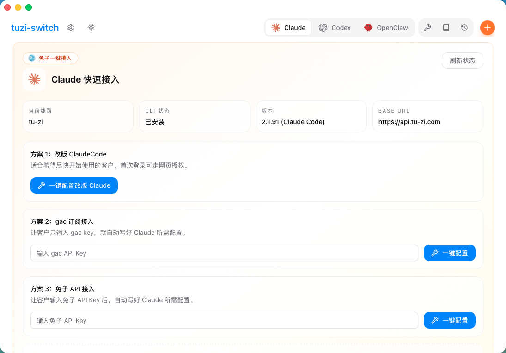
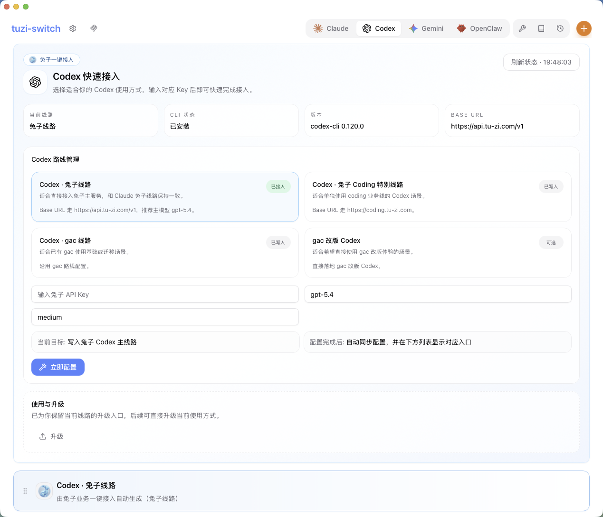
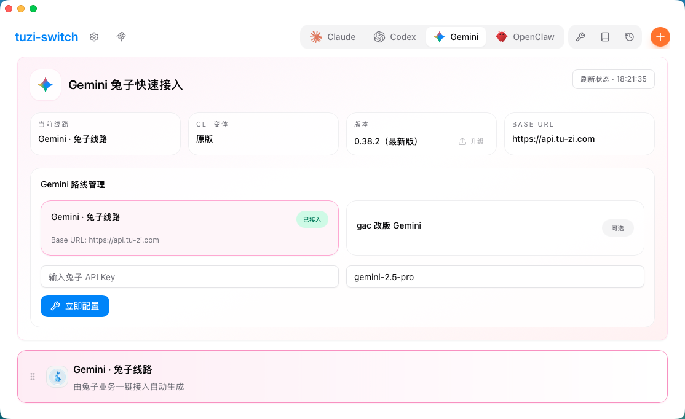
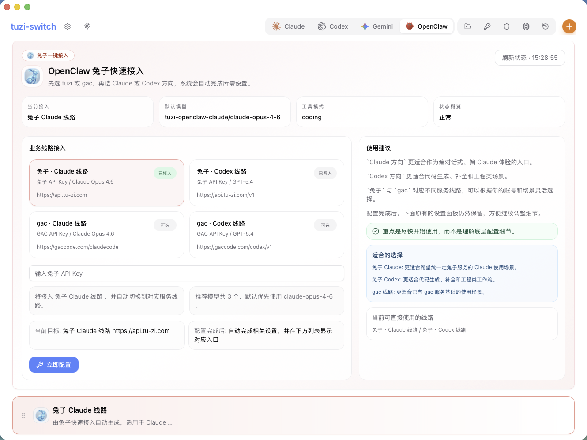

<div align="center">

# tuzi-switch

### Claude Code、Codex、Gemini、OpenClaw 向けの Tuzi 業務デスクトップアシスタント

[](https://github.com/tuziapi/tuzi-switch/releases)
[](https://github.com/tuziapi/tuzi-switch/releases)
[](https://github.com/tuziapi/tuzi-switch/releases)
[](https://tauri.app/)

[中文](README.md) | [English](README_EN.md) | 日本語 | [Releases](https://github.com/tuziapi/tuzi-switch/releases)

</div>

## ダウンロード

最新のインストーラは [GitHub Releases](https://github.com/tuziapi/tuzi-switch/releases) から取得できます。

推奨パッケージ:

- Windows: Windows インストーラをダウンロード
- Linux: `.AppImage`、`.deb`、`.rpm`
- macOS: `macOS-unsigned.dmg` または `macOS-unsigned.zip`

現在の公開 Release は Windows / Linux での利用を前提にしています。macOS は未署名のテストビルドです。

### macOS / Linux ワンコマンドインストール

現在の推奨版 `v3.12.19` を直接インストール:

```bash
curl -fsSL https://raw.githubusercontent.com/tuziapi/tuzi-switch/main/scripts/install_tuzi_switch.sh | env TUZI_SWITCH_TAG=v3.12.19 bash
```

補足:

- 現在の Release は正式版として公開され、GitHub `releases/latest` は現在の推奨版を指す想定です
- README のコマンドは `v3.12.19` に固定し、現在の推奨版を確実に入れられるようにしています
- 別バージョンを入れたい場合は `TUZI_SWITCH_TAG=vX.Y.Z` の値を差し替えてください

### macOS 未署名ビルド

初回起動時に macOS にブロックされた場合は、次のいずれかを実行してください。

1. アプリを右クリックして `開く` を選び、確認ダイアログでもう一度 `開く` を押す
2. またはターミナルで以下を実行する

```bash
xattr -dr com.apple.quarantine "/Applications/tuzi-switch.app"
open "/Applications/tuzi-switch.app"
```

`/Applications` 以外に配置した場合は、パスを実際の場所に置き換えてください。

## tuzi-switch とは

tuzi-switch は CC Switch をベースにした Tuzi 業務向けのカスタム版です。多ツール管理の基盤は残しつつ、Tuzi のお客様がより簡単に接続できる導線を優先しています。

現在の中心入口は次の 4 つです。

- Claude Code
- Codex
- Gemini
- OpenClaw

ユーザーは Tuzi Key を 1 回入力するだけで、ルート設定とローカル設定をより素早く完了できます。設定ファイルを手動編集する前提ではありません。

## 現在のバージョン更新内容

現在の公開版は `v3.12.19` で、今回の主な更新は以下です。

- Claude / Codex / Gemini で Node.js/npm がない場合、`npm: command not found` をそのまま出さず、確認後に依存関係を自動インストールして元の設定処理を続行します
- macOS は Homebrew、Linux は apt/dnf/yum、Windows は winget を使って Node.js/npm を導入します
- OpenClaw クイック接入にデフォルトモデル選択を追加し、完全なモデル一覧を書き込みつつ、選択モデルを primary と fallbacks に同期します
- Claude / Codex / Gemini のルートカードの「書き込み済み」は下部の業務 provider カードが存在することだけを表すようになり、カード削除後に誤表示されません
- 原版の削除挙動は維持し、非現在 provider はカードのみ削除、現在 provider は引き続き削除不可、実際の CLI 設定は上部ステータスで表示します
- Release と README の固定インストールコマンドを `v3.12.19` に同期しました

## 製品のポイント

- Claude Code、Codex、Gemini、OpenClaw 向けの Tuzi 優先クイック入口
- メイン画面から Tuzi / GAC ラインの案内付きで接続設定を実行
- Tuzi ブランドのビジュアル、アイコン、接入カード
- アプリ内でのプロバイダ切り替えとデスクトップ版ベースのトレイ切り替え導線
- Providers、MCP、Prompts、Skills など既存基盤機能を継続利用
- Tauri 2 ベースのデスクトップアプリ構成

## 現在のカスタマイズ方針

上流版と比べると、この版は汎用的な高機能ツールというより、業務導入と顧客オンボーディングを重視しています。

- 右上の入口エリアを Tuzi 接続フロー向けに再構成
- Claude Code、Codex、Gemini、OpenClaw に個別のインストール / 設定入口を用意
- Tuzi クイック設定を主要導線として前面に配置
- 一部の汎用設定や構成フローを簡素化

## 画面プレビュー

### Claude



### Codex



### Gemini



### OpenClaw



## クイックスタート

1. [Releases](https://github.com/tuziapi/tuzi-switch/releases) から最新版をダウンロード
2. `tuzi-switch` を起動
3. Claude Code、Codex、Gemini、OpenClaw のいずれかを選択
4. ガイドに従って Tuzi Key を入力
5. ワンクリック設定を完了して利用開始

## 主な機能

### ツール入口

- Claude Code、Codex、Gemini、OpenClaw の独立した入口
- 対応ツール向けのインストール / 更新ガイド
- 汎用プロバイダ設定よりも業務導線を優先した画面構成

### プロバイダ管理

- プロバイダの追加、編集、有効化、無効化、インポート、エクスポート
- 適用可能な範囲で複数ツールへ同一設定を同期
- アプリ内から現在のプロバイダを切り替え

### MCP、Prompts、Skills

- MCP の基本管理機能を継続搭載
- 対応ツール間の Prompt ファイル同期を維持
- 上流デスクトップ基盤由来の Skills インストール / 同期フローを利用

注記:

- 一部の同期挙動はツールごとに差があります
- OpenClaw 関連の一部連携機能は引き続き調整中です

### データとローカル保存先

上流との互換性維持のため、ローカルデータは現在も CC Switch の保存パスを利用しています。

- `~/.cc-switch/cc-switch.db`
- `~/.cc-switch/settings.json`
- `~/.cc-switch/backups/`
- `~/.cc-switch/skills/`

## 開発計画 / TODO

- 完了: Node.js/npm 不足時の確認、自動依存インストール、元の設定処理への継続
- 完了: OpenClaw のデフォルトモデル選択、primary/fallbacks 書き込み、設定後のデフォルトモデル同期
- 完了: クイック接入の「書き込み済み」状態を下部の業務 provider カード存在性に合わせました
- 完了: README、バージョン情報、Release 文案を `v3.12.19` に同期
- 進行中: Windows 顧客環境の実フィードバックを継続収集し、Node/npm、PATH、winget、CLI shim の差異を追跡
- 進行中: OpenClaw のセッション復元、デフォルトモデル選択、業務ルート表現を継続改善
- 進行中: ライト / ダーク両テーマで、ルートカード、状態ブロック、ヒント領域、リスト高亮をさらに揃える
- 次: Release 文案と顧客向けインストール案内をさらに簡潔にする
- 次: macOS 署名配布と顧客向けインストール説明を継続整備する

## 補足

- このリポジトリは Tuzi 業務シナリオ向けのカスタム分岐です
- 一部の文書や内部パスには上流由来の命名が残っています
- 配布パッケージはこのリポジトリの GitHub Releases から提供されます

## クレジット

tuzi-switch はオープンソースの CC Switch を土台として構築されています。その上で、Tuzi 業務フローに合う体験へ再設計を進めています。
